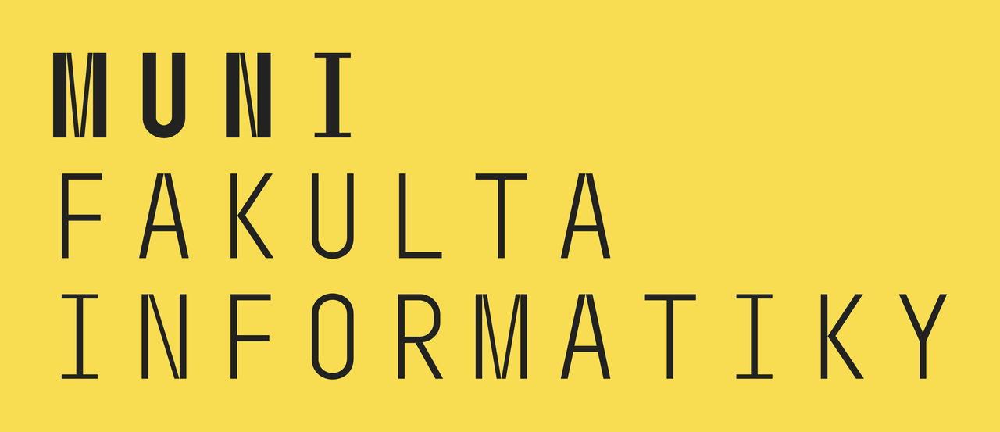
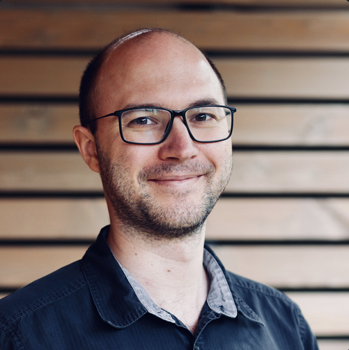
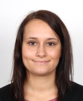
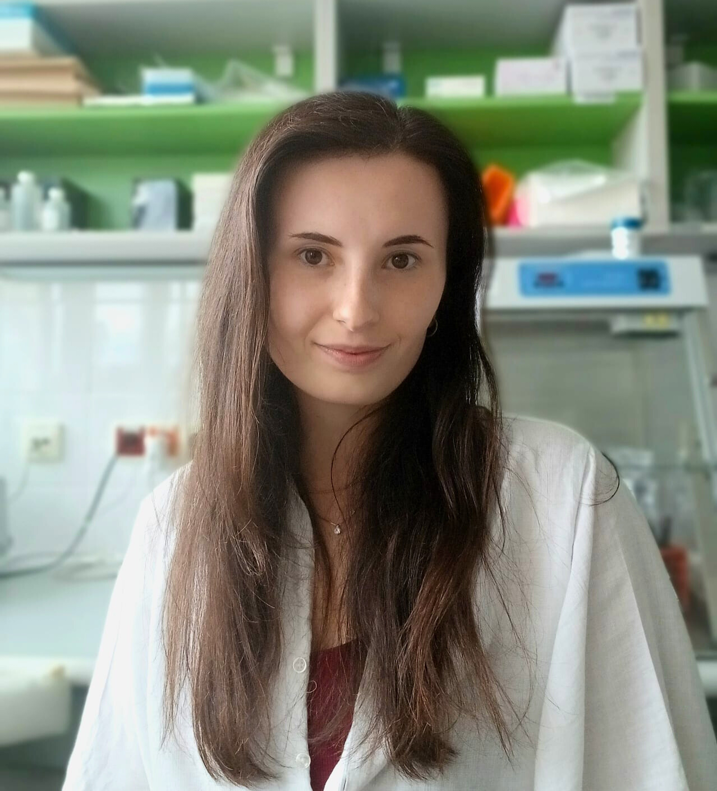

<p class="workshop-date"><strong>Date:</strong> 2025-09-05</p>


<p align="center">
  
</p>

# Bioinformatics workshop

## 🧬 8:30 – 8:45 Important workshop information

### **HOW TO LOGIN TO THE COMPUTERS IN A219**  
Everyone will use the same guest account, with the same username and password.  
*guest00*  
*fibioinfo25*  

### **DOWNLOAD THIS FOLDER NOW**  
This will take a few minutes, so please get started now and download the following folder:  
https://drive.google.com/drive/folders/1OhD8guYEJQ4_Y3Dvws0272YS4bqzlJ6Y?usp=sharing  

- Welcome & overview  
- Participants: who uses methylation and why  
- Collect questions  

### **OBTAIN THE DOCKER IMAGE WITH INSTALLED TOOLS**

**Option A: Build from source (7-10m)**

```bash
git clone git@github.com:bioinf-fi/docker.git
cd docker/ontmet
make build ENGINE=podman # or explicitly: podman build --load -t bioinf-fi/ontmet:latest -f ontmet.Dockerfile . 
```

**Option B: Import from pre-built image file (1m)** 

```bash
podman import /var/tmp/ontmet.tar.gz bioinf-fi/ontmet:latest
```

**Prepare working dir and run**

  ```bash
  mkdir workshop
  chown $(id -u):$(id -g) workshop
  cd workshop

  # copy the downloaded files here
  
  podman run -it --rm --user $(id -u):$(id -g) -v "$PWD:/data" bioinf-fi/ontmet:latest bash
  ```

# 👩‍🏫 Workshop Teaching Assistants

We are excited to introduce our **Teaching Assistants (TAs)** who will be supporting the workshop.  

---

## 1. Monika Cechova


- 🎓 Assistant Professor at the Faculty of Informatics, interested in the most complex parts of the human genome
- 🌟 Role: Leading the **methylation analysis** exercises

---

## 2. Honza Kotrs


- 🎓 Background: Computational Biologist and programmer
- 💻 Expertise: Workflow automation, engineering  
- 🌟 Role: Supporting **technical setup** and troubleshooting

---

## 3. Patricie Skaláková


- 🎓 Background: PhD student in the Genomics of Immune Cells research group at MED MUNI
- 🧬 Expertise: She is currently focusing on the analysis of genomic variants in patients with CLL
- 🌟 Role: Teaching assistant

---

## 4. Sabina Adamová


- 🎓 Background: Ph.D. student in Experimental Oncology and Tumor Biology
- 🧬 Expertise: She is currently focusing on the detection of structural variants in hematologic malignancies using nanopore sequencing
- 🌟 Role: Teaching assistant

---

## 📌 Note
All TAs will be available anytime during the workshop, as well as during coffee break and the lunch.
