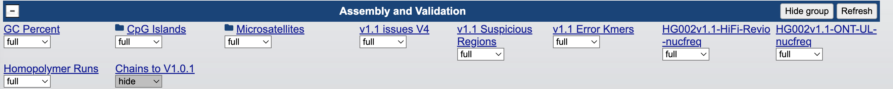

# Assembly QC and annotation

In order to understand which QC datasets and general annotations are useful and/or available, let's use complete, diploid genome HG002 as an example. Because the genome is diploid, we will have 23 maternal and 23 paternal chromosomes available. We can therefore choose whether we want to use maternal or paternal genome as our reference.

The list of T2T genomes is available at this [UCSC genome browser hub] (https://genome.ucsc.edu/cgi-bin/hgHubConnect?hgHub_do_redirect=on&genome=HG002v1.1.PAT&hubUrl=https://research.nhgri.nih.gov/CustomTracks/T2T_hubs/T2Tgenomes/hub.txt). Let's select paternal genome version 1.1. This is a big genome with lots of tracks, so pick a smaller region if the tracks are not loading. You can type the coordinates in the search bar and hit enter 

## Exploration

This section will be exploratory, letting you play around to understand the various types of annotation. Click on on annotation name will show you a help page with detailed descriptions. Note that Tools -> Table browser will allow you to directly download any annotation of interest. 

## QC

Let's go over some QC tracks now:

Let's turn on some diagnostic plots and hit refresh. 

You will see suspicious regions, issues track that includes annotation from NucFlag, erroneous k-mers, as well ad NucFreq tracks on both PacBio and Nanopore. 

*Flagger HiFi:* (not directly available for Q100)
The coverage-based analysis using HiFi reads by PacBio. In an ideal world, the coverage (how many basepairs cover each nucleotide in the assembled reference) to be uniform, after accounting for the noise of the random molecule sampling. 

*Flagger ONT:* (not directly available for Q100)
Same but using nanopore reads. Flagger has somewhat worse performance using ONT reads. Note that on the assemblies with extremely high quality, both Flagger HiFi and Flagger ONT will give false positives rather than false negatives (in other words, flagging correct regions as incorrect, rather than incorrect regions as correct).
.

*Nucflag:*
Combined functionality of Flagger and Nucfreq developed by another group, tends to overannotate regions as potentially problematic.

*Nucfreq:*
Nucfreq calculates the minor allele frequency. Note that in haplotyoe-resolved assemblies, all mapped reads should support the nucleotide in the reference, and other than (sometimes systematic) sequencing errors, no variation is expected.  

## Annotation

Let's also cover some general annotations:

*genes:* (find RefSeq track in the section *Genes and Gene Predictions*)
This track includes gene annotations of various kind -- protein coding, non-coding RNA, or gene models.

*repeats:* (section Repeats and Assembly and Validation)
These include repeatmasker track, microsatellites, or satellite DNA, depending on the specific track. 

*methylation:* (section Regulation)
This track includes methylation data, typically derived from long reads (HiFi or ONT). Note that both HiFi- and ONT-derived methylation is more accurate than the methylation derived from the bisulfite sequencing.

Generating these tracks, or a subset of herein, will help you utilize your assemblies to the fullest, and will reassure you of their completness and accuracy. 
