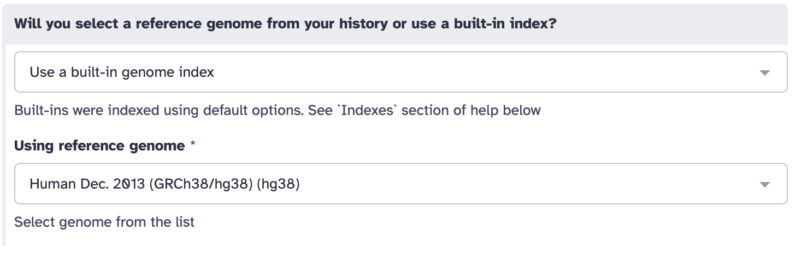
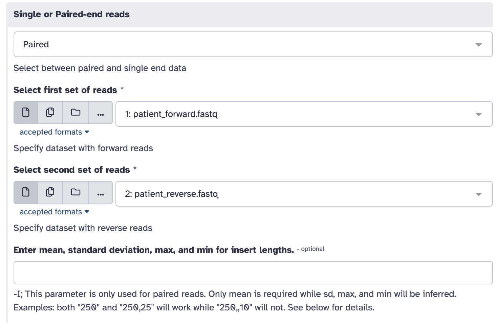
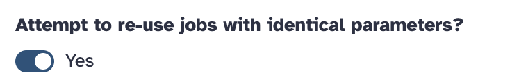

# Czech Hopes Workshop - Task 2 (GALAXY)

### Časť 2 - načítanie histórie
1. Prejdite na https://usegalaxy.eu/
2. Load the data:
   Histories -> Public histories -> czech hopes 2026 ([https://usegalaxy.eu/u/xpolako3/h/czech-hopes-2026](https://usegalaxy.eu/u/xpolako3/h/czech-hopes-2026-1)) -> Import this history

## TASK

### Mapping
- **Tool** : BWA-MEM2
- **Parametre nastavte nasledovne**
    -  referenčný genóm  
       
    - pacientské dáta  
    
    - iné nstavenia  
    
    - **OSTATNÉ NEMEŇTE!!!**

### Hľadanie mutácie
1. V histórii kliknite na `View (symbol oka)` po tom čo mapping skončí.
2. V genómovom prehliadači chodťe na chromozóm 11 na pozíciu `chr11:5217179-5234011`.
3. Nájdite pozíciu mutácie.
